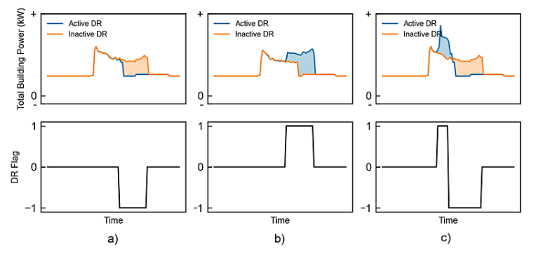

# FlexTrack Challenge 2025 Competition - Flag(Anomaly) Detection and Capacity Prediction

## Overview

This repository contains our solution for the FlexTrack Challenge 2025 Competition - Flag(Anomaly) Detection and Capacity Prediction Competition, which focused on predicting energy consumption anomalies (flags) and capacity forecasting across multiple energy sites. Our approach achieved competitive results with geometric mean F1 scores ranging from **72.0 to 72.4** in the competition phase, representing one of the most consistent and best-performing solutions.

<p align="center">
  
</p>

<p align="center">
  <b>Main Purpose Of The Competition</b>
</p>

**Competition Duration:** 1.5 months  
**Final Phase:** Competition Phase  
**Primary Approach:** LSTM-based time series modeling

## Problem Statement

### Phase 1: Flag Prediction
The primary challenge involved predicting anomaly flags in energy consumption data across multiple sites. Key challenges included:

- **Imbalanced Dataset:** Significant class imbalance between normal and anomalous behavior
- **Irregular Time Series:** Non-uniform temporal patterns across different sites
- **Site Heterogeneity:** Each site exhibited unique consumption patterns and characteristics
- 
### Phase 2: Capacity Prediction
Forecasting energy capacity requirements based on historical consumption patterns and site-specific features.

## Methodology

### 1. Site-Based Segmentation

Rather than training a single global model, we developed a **site-specific modeling approach**:

- Analyzed power consumption patterns across all sites
- Identified distinct consumption profiles
- Grouped sites based on consumption characteristics
- Trained separate models for each site or site group

This approach proved crucial as each site exhibited unique:
- Load patterns
- Peak consumption times
- Seasonal variations
- Anomaly characteristics

### 2. Temporal Feature Engineering

We implemented strategic time windowing to improve model performance:

- **Original Data:** 24-hour coverage
- **Optimized Window:** 7:00 AM - 7:00 PM (12 hours)

**Rationale:** This reduction focused on active consumption hours, eliminating low-activity nighttime periods that added noise and reduced model effectiveness.

### 3. Model Selection: LSTM Architecture

After extensive experimentation with multiple approaches, LSTM (Long Short-Term Memory) networks emerged as the superior solution:

#### Approaches Tested:
1. **LSTM Networks** ✅ (Selected)
2. Traditional Neural Networks
3. Tree-Based Models (Random Forest, XGBoost, LightGBM)

#### Why LSTM Performed Best:
- **Temporal Dependencies:** Captured long-term patterns in irregular time series data
- **Memory Mechanism:** Retained relevant historical context for prediction
- **Flexibility:** Adapted well to site-specific patterns
- **Robustness:** Handled imbalanced data better than tree-based models

### 4. Training Strategy

#### Flag Prediction:
- Site-specific LSTM models with optimized hyperparameters
- Custom loss functions to handle class imbalance
- Sequence-to-sequence architecture for temporal context
- Enhanced feature engineering including:
  - Temporal features (hour, day of week, month)
  - Rolling statistics (mean, std, min, max)
  - Lag features
  - Capacity-based features

#### Capacity Prediction:
- Similar LSTM architecture adapted for regression
- Multi-step forecasting capabilities
- Feature engineering focused on consumption trends

## Project Structure

```
.
├── datasets/                          # Raw competition data
│   ├── training-data-v0.2.csv
│   ├── test-data-v0.2.csv
│   └── test-data-v0.3.csv
│
├── LSTM_model_prediction_flags.ipynb  # Main flag prediction notebook
├── LSTM_model_prediction_capacity.ipynb # Main capacity prediction notebook
```

## Results

### Flag Prediction Performance

| Metric | Score Range |
|--------|-------------|
| **Geometric Mean F1** | 72.0 - 72.4 |
| **Consistency** | High (minimal variance across sites) |
| **Competition Rank** | Top tier in competition phase |

### Capacity Prediction Performance

| Metric | Score (Normalized) |
|--------|-------------------|
| **MAE** | 1.156 |
| **RMSE** | 1.243 |


### Key Insights
1. **Site-specific modeling** significantly outperformed global models
2. **Time window reduction** (7 AM - 7 PM) improved both accuracy and training efficiency
3. **LSTM architecture** was crucial for capturing temporal dependencies
4. **Feature engineering** particularly rolling statistics and lag features, provided substantial improvements

## Installation & Setup

### Requirements
```bash
pip install -r requirements.txt
```

Key dependencies:
- TensorFlow/Keras (LSTM implementation)
- pandas, numpy (data processing)
- scikit-learn (preprocessing, metrics)

### Running the Models

#### Flag Prediction:
```python
# Jupyter notebook
jupyter notebook LSTM_model_prediction_flags.ipynb

```

#### Capacity Prediction:
```python
# Jupyter notebook
jupyter notebook LSTM_model_prediction_capacity.ipynb

```

## Model Training Pipeline

1. **Data Preprocessing:**
   - Load site-specific data
   - Filter time window (7 AM - 7 PM)
   - Feature engineering

2. **Model Training:**
   - Train LSTM models per site
   - Validate on hold-out set
   - Save models and scalers

3. **Prediction & Submission:**
   - Load test data
   - Apply same preprocessing
   - Generate predictions
   - Format for submission

## Lessons Learned

### What Worked:
✅ Site-specific modeling approach  
✅ LSTM architecture for temporal patterns  
✅ Time window optimization (7 AM - 7 PM)  
✅ Extensive feature engineering  
✅ Iterative model refinement over 1.5 months  

### What Didn't Work as Well:
❌ Global models across all sites  
❌ Traditional neural networks (insufficient temporal modeling)  
❌ Tree-based models (struggled with sequential dependencies)  
❌ Full 24-hour data windows (added noise)  

## Future Improvements

1. **Transfer Learning:** Leverage patterns from high-data sites for low-data sites
2. **Real-time Prediction:** Optimize models for online learning and inference
3. **Explainability:** Add interpretability tools to understand flag predictions

## Team & Competition Info

**Competition:** International Energy Competition  
**Task:** Anomaly Detection (Flags) and Capacity Prediction  
**Approach:** Site-specific LSTM modeling  
**Duration:** 1.5 months  
**Performance:** Geometric Mean F1: 72.0-72.4 (Competition Phase)  

## Acknowledgments

This project represents extensive experimentation and refinement over the competition period. The success of the LSTM-based, site-specific approach demonstrates the importance of:
- Understanding domain-specific characteristics (site heterogeneity)
- Leveraging appropriate architecture (LSTM for time series)
- Strategic data preprocessing (time window optimization)
- Patience in iterative improvement

---

**Note:** This repository contains code and datasets. Please respect competition rules and ethical guidelines when using or referencing this work.

